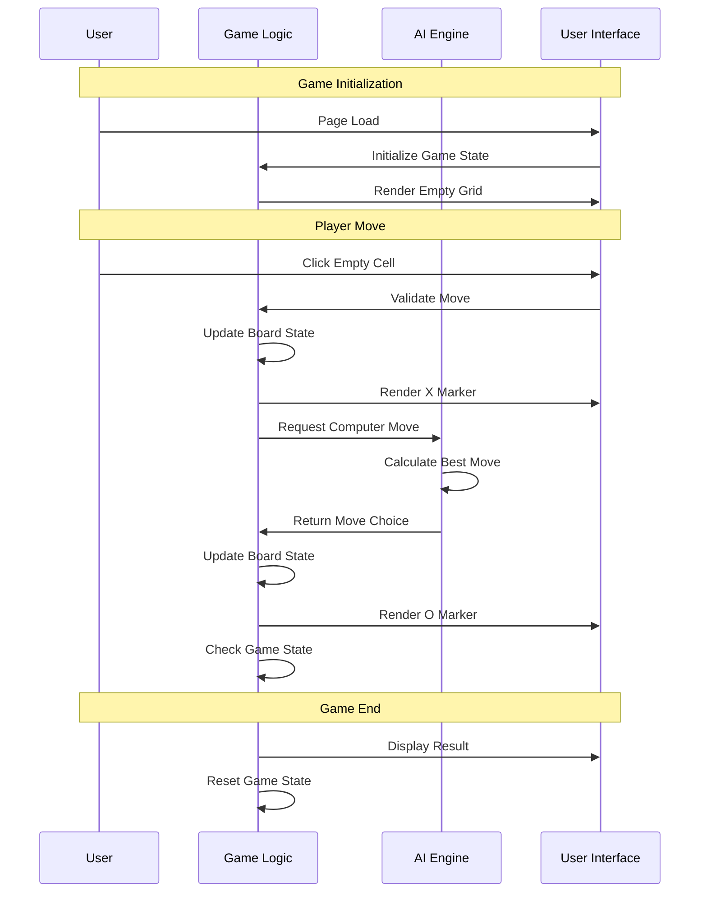

# TIC-TAC-TOE-GAME Tic-Tac-Toe Game - Implementation Planning

## User Story

As a player, I want to play a complete tic-tac-toe game against a computer opponent in a responsive web browser interface, so that I can enjoy the game on any device with an intuitive and visually appealing experience.

## Pre-conditions

- Modern web browser with JavaScript enabled
- No server-side dependencies required
- No external libraries or frameworks needed
- Static file hosting capability (file system or web server)

## Design

### Visual Layout

The game will feature a minimalist, centered layout with:
- **Game Grid**: 3x3 grid as the primary focal point
- **Game Status**: Subtle status indicator for current player/game state
- **Reset Functionality**: Implicit reset when game ends
- **Responsive Container**: Centered game area that scales appropriately

### Color and Typography

**Earth-Tone Color Palette**:

- **Background Colors**: 
  - Primary: #F5F5DC (beige)
  - Secondary: #D2B48C (tan)
  - Accent: #8B4513 (saddle brown)

- **Typography**:
  - Game markers: Large, bold sans-serif font
  - Status text: Medium weight, readable serif font
  - Colors: #4A4A4A (dark gray) for text, #8B4513 (brown) for accents

- **Grid Styling**:
  - Grid background: #F5F5DC (beige)
  - Grid lines: #8B4513 (saddle brown)
  - Hover state: #E6E6FA (light lavender) with X outline
  - Active markers: #4A4A4A (dark gray) for X, #8B4513 (brown) for O

### Interaction Patterns

- **Grid Cell Hover**: 
  - Visual feedback with subtle background color change
  - Semi-transparent X outline preview
  - Smooth 200ms transition
  - Only active on empty cells

- **Grid Cell Click**:
  - Immediate placement of X marker
  - Automatic computer response (300ms delay for UX)
  - Visual feedback for both moves
  - Disabled state for occupied cells

### Measurements and Spacing

**Desktop Layout (768px+)**:
```
- Container: max-width 600px, centered
- Grid: 400px x 400px
- Cell size: 120px x 120px
- Grid gap: 4px
- Marker font-size: 48px
```

**Mobile Layout (< 768px)**:
```
- Container: 90% width, centered
- Grid: 300px x 300px
- Cell size: 90px x 90px
- Grid gap: 3px
- Marker font-size: 36px
```

### Responsive Behavior

- **Desktop (768px+)**:
  - Fixed grid size (400px)
  - Hover effects enabled
  - Mouse-optimized interactions

- **Mobile (< 768px)**:
  - Scaled grid size (300px)
  - Touch-optimized tap targets
  - Increased touch padding
  - Responsive font scaling

## Technical Requirements

### Component Structure

```
tic-tac-toe-game/
├── index.html                    # Main HTML document
├── css/
│   └── styles.css               # Game styling and responsive design
├── js/
│   ├── game.js                  # Main game logic and state management
│   ├── ai.js                    # Computer AI decision making
│   └── utils.js                 # Utility functions and helpers
└── README.md                    # Project documentation
```

### Required Components

- **HTML Structure** ✅
- **CSS Styling with Earth Tones** ✅
- **Game State Management** ✅
- **AI Decision Engine** ✅
- **User Interface Logic** ✅
- **Responsive Design Implementation** ✅

### State Management Requirements

```javascript
// Game State Structure
const gameState = {
  // Board state (3x3 grid)
  board: [
    ['', '', ''],
    ['', '', ''],
    ['', '', '']
  ],
  
  // Game status
  currentPlayer: 'X',        // Always starts with player
  gameActive: true,
  winner: null,              // null, 'X', 'O', or 'draw'
  
  // UI state
  isComputerTurn: false,
  hoveredCell: null
};

// State Management Functions
const gameActions = {
  makeMove: (row, col) => void,
  resetGame: () => void,
  checkWinner: () => string | null,
  getAvailableMoves: () => Array<{row: number, col: number}>,
  updateUI: () => void
};
```

## Acceptance Criteria

### Layout & Content

1. **Game Grid Layout**
   - 3x3 grid of clickable squares
   - Centered on page with responsive sizing
   - Clear visual separation between cells
   - Earth-tone color scheme throughout

2. **Responsive Design**
   - Scales appropriately on mobile devices (300px grid)
   - Maintains usability on desktop (400px grid)
   - Touch-friendly interaction areas on mobile
   - Consistent experience across orientations

3. **Visual Feedback**
   - Hover effects show X outline on empty cells
   - Immediate visual response to user clicks
   - Clear distinction between X and O markers
   - Smooth transitions and animations

### Functionality

1. **Core Game Mechanics**

   - [ ] Player always plays as X and moves first
   - [ ] Computer responds as O after each player move
   - [ ] Only empty cells are clickable
   - [ ] Game detects win conditions (3 in a row/column/diagonal)
   - [ ] Game detects draw conditions (board full, no winner)

2. **AI Behavior**

   - [ ] Computer makes optimal moves based on current board state
   - [ ] AI prioritizes winning moves when available
   - [ ] AI blocks player winning moves when possible
   - [ ] AI makes strategic moves when no immediate threats/opportunities
   - [ ] Computer response has slight delay (300ms) for better UX

3. **User Interface**
   - [ ] Visual hover preview shows where X will be placed
   - [ ] Clicking empty cell immediately places X marker
   - [ ] Computer move is visually indicated after placement
   - [ ] Game automatically resets after completion
   - [ ] No additional buttons or controls needed

### Navigation Rules

- Single-page application with no navigation required
- Game resets automatically when completed
- No menu system or additional screens
- Focus remains on the game grid throughout experience

### Error Handling

- Clicking occupied cells has no effect (no error messages needed)
- Invalid moves are silently ignored
- Game state remains consistent even with rapid clicking
- Graceful handling of edge cases (rapid successive clicks)

## Modified Files

```
tic-tac-toe-game/
├── index.html ✅                # Main game structure and grid
├── css/
│   └── styles.css ✅           # Responsive design, earth tones, hover effects
├── js/
│   ├── game.js ✅              # Game state, move handling, UI updates
│   ├── ai.js ✅                # Computer AI logic and move selection
│   └── utils.js ✅             # Helper functions for game logic
└── README.md ✅                # Project documentation and setup
```

## Status

🟩 COMPLETED

1. **Setup & Configuration**

   - [x] Create project directory structure
   - [x] Set up HTML boilerplate with semantic structure
   - [x] Initialize CSS with earth-tone color variables
   - [x] Set up JavaScript module structure

2. **Layout Implementation**

   - [x] Create responsive 3x3 grid layout
   - [x] Implement earth-tone color scheme
   - [x] Add responsive breakpoints for mobile/desktop
   - [x] Style game markers (X and O)

3. **Core Game Logic**

   - [x] Implement game state management
   - [x] Create move validation system
   - [x] Add win/draw detection logic
   - [x] Build board update mechanisms

4. **AI Implementation**

   - [x] Create AI decision-making algorithm
   - [x] Implement move prioritization (win > block > strategic)
   - [x] Add computer move delay for UX
   - [x] Test AI against various game scenarios

5. **User Interface**
   - [x] Add click event handlers for grid cells
   - [x] Implement hover effects with X preview
   - [x] Create visual feedback for moves
   - [x] Add game state indicators

6. **Testing & Polish**
   - [x] Test responsive behavior across devices
   - [x] Validate game logic edge cases
   - [x] Ensure smooth user experience
   - [x] Performance optimization

## Dependencies

- No external dependencies required
- Modern browser with ES6+ JavaScript support
- CSS Grid and Flexbox support
- Touch event support for mobile devices

## Related Stories

- [01] Play Against Computer - Core AI functionality
- [02] Responsive Game Interface - Mobile/desktop compatibility
- [03] Visual Move Preview - Hover effect implementation
- [04] Minimalist Earth-Tone Design - Visual design system
- [05] Static Web Application - No-server architecture
- [06] Interactive Game Grid - Click-to-play mechanics

## Notes

### Technical Considerations

1. **AI Algorithm**: Implement minimax algorithm with alpha-beta pruning for optimal computer moves
2. **Performance**: Ensure smooth animations and responsive interactions
3. **Accessibility**: Include proper ARIA labels and keyboard navigation support
4. **Browser Compatibility**: Target modern browsers (ES6+) for clean code
5. **Touch Optimization**: Ensure touch targets are appropriately sized (44px minimum)

### Business Requirements

- Zero-dependency static web application
- Immediate playability without setup or configuration
- Intuitive user experience requiring no instructions
- Professional appearance suitable for portfolio showcase

### Game Logic Implementation

#### AI Decision Tree

```javascript
// AI Move Priority System
const aiStrategy = {
  1: 'checkWinningMove',      // Can AI win in one move?
  2: 'blockPlayerWin',        // Must block player from winning?
  3: 'takeCenterIfAvailable', // Take center if open
  4: 'takeCornerIfAvailable', // Take corner if open
  5: 'takeAnyAvailable'       // Take any remaining space
};
```

#### Win Condition Detection

```javascript
// Win patterns for 3x3 grid
const winPatterns = [
  // Rows
  [[0,0], [0,1], [0,2]],
  [[1,0], [1,1], [1,2]],
  [[2,0], [2,1], [2,2]],
  // Columns
  [[0,0], [1,0], [2,0]],
  [[0,1], [1,1], [2,1]],
  [[0,2], [1,2], [2,2]],
  // Diagonals
  [[0,0], [1,1], [2,2]],
  [[0,2], [1,1], [2,0]]
];
```

### State Management Flow



### CSS Architecture

```css
/* CSS Custom Properties for Earth Tones */
:root {
  --bg-primary: #F5F5DC;    /* Beige */
  --bg-secondary: #D2B48C;  /* Tan */
  --accent-primary: #8B4513; /* Saddle Brown */
  --text-primary: #4A4A4A;   /* Dark Gray */
  --hover-color: #E6E6FA;    /* Light Lavender */
  
  /* Responsive Breakpoints */
  --mobile-breakpoint: 768px;
  --grid-size-desktop: 400px;
  --grid-size-mobile: 300px;
  --cell-size-desktop: 120px;
  --cell-size-mobile: 90px;
}
```

## Testing Requirements

### Integration Tests (Target: 90% Coverage)

1. **Core Game Logic Tests**

```javascript
describe('Tic-Tac-Toe Game Logic', () => {
  it('should detect horizontal win conditions', () => {
    // Test all horizontal win scenarios
  });

  it('should detect vertical win conditions', () => {
    // Test all vertical win scenarios
  });

  it('should detect diagonal win conditions', () => {
    // Test both diagonal win scenarios
  });

  it('should detect draw conditions', () => {
    // Test board full with no winner
  });

  it('should prevent moves on occupied cells', () => {
    // Test invalid move handling
  });
});
```

2. **AI Behavior Tests**

```javascript
describe('Computer AI', () => {
  it('should make winning move when available', () => {
    // Test AI prioritizes winning
  });

  it('should block player winning moves', () => {
    // Test defensive AI behavior
  });

  it('should make strategic moves', () => {
    // Test center/corner preference
  });

  it('should handle edge cases gracefully', () => {
    // Test unusual board states
  });
});
```

3. **User Interface Tests**

```javascript
describe('User Interface', () => {
  it('should show hover effects on empty cells', () => {
    // Test hover state behavior
  });

  it('should update grid immediately on click', () => {
    // Test responsive UI updates
  });

  it('should handle rapid clicking gracefully', () => {
    // Test click handling edge cases
  });

  it('should maintain responsive layout', () => {
    // Test responsive behavior
  });
});
```

### Performance Tests

1. **Rendering Performance**

```javascript
describe('Performance', () => {
  it('should render moves within acceptable time limits', () => {
    // Test rendering performance
  });

  it('should handle AI calculations efficiently', () => {
    // Test AI response time
  });
});
```

### Accessibility Tests

```javascript
describe('Accessibility', () => {
  it('should provide keyboard navigation support', () => {
    // Test keyboard accessibility
  });

  it('should include proper ARIA labels', () => {
    // Test screen reader compatibility
  });

  it('should maintain focus management', () => {
    // Test focus handling
  });
});
```

### Cross-Browser Compatibility

- **Chrome/Chromium**: Primary target
- **Firefox**: Secondary target  
- **Safari**: Mobile compatibility
- **Edge**: Windows compatibility

### Mobile Testing Requirements

- **iOS Safari**: iPhone/iPad compatibility
- **Android Chrome**: Android device compatibility
- **Touch Event Handling**: Proper touch response
- **Viewport Scaling**: Correct responsive behavior
